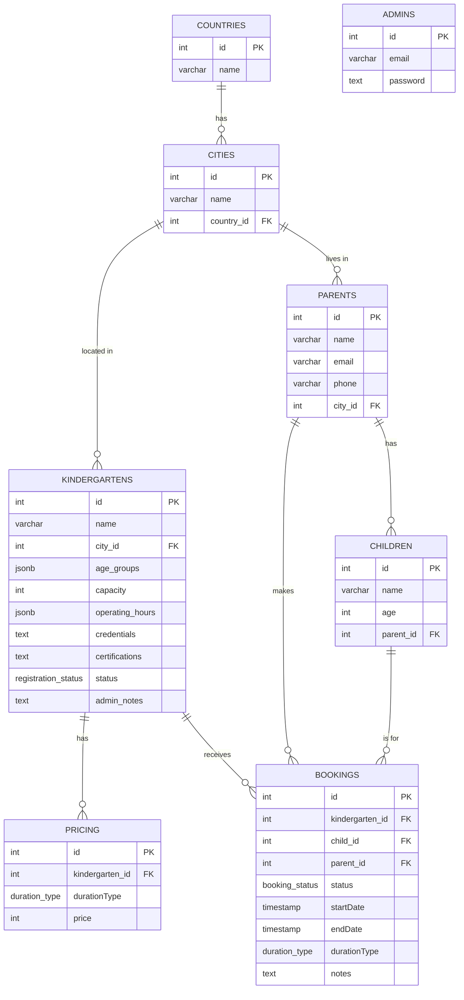

```mermaid
erDiagram
    COUNTRIES {
        int id PK
        varchar name
    }

    CITIES {
        int id PK
        varchar name
        int country_id FK
    }

    KINDERGARTENS {
        int id PK
        varchar name
        int city_id FK
        jsonb age_groups
        int capacity
        jsonb operating_hours
        text credentials
        text certifications
        registration_status status
        text admin_notes
    }

    PRICING {
        int id PK
        int kindergarten_id FK
        duration_type durationType
        int price
    }

    BOOKINGS {
        int id PK
        int kindergarten_id FK
        int child_id FK
        int parent_id FK
        booking_status status
        timestamp startDate
        timestamp endDate
        duration_type durationType
        text notes
    }

    PARENTS {
        int id PK
        varchar name
        varchar email
        varchar phone
        int city_id FK
    }

    CHILDREN {
        int id PK
        varchar name
        int age
        int parent_id FK
    }

    ADMINS {
        int id PK
        varchar email
        text password
    }

    COUNTRIES ||--o{ CITIES : "has"
    CITIES ||--o{ KINDERGARTENS : "located in"
    CITIES ||--o{ PARENTS : "lives in"
    KINDERGARTENS ||--o{ PRICING : "has"
    KINDERGARTENS ||--o{ BOOKINGS : "receives"
    PARENTS ||--o{ CHILDREN : "has"
    PARENTS ||--o{ BOOKINGS : "makes"
    CHILDREN ||--o{ BOOKINGS : "is for"
```